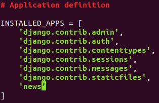

D5.4. Что такое модель
=====================
База данных, связи, ключи пройдены, пора вернуться к нашему Django-проекту. 
В этом юните мы разберёмся с такими вещами, как:

- Django-проекты;
- подробнее поговорим про приложения;
- MVC и MTV шаблоны;
- подключение к базе данных;
- модели и что они скрывают.  

###  Django-проекты 
Потихоньку подбираемся к самому интересному — работе с Django!

Почему все так любят фреймворки? Казалось бы, они создают обёртки для более низкоуровневых функций, а также функционал 
для работы с ними. И с такой точки зрения интерес вызван ленивостью программистов — гораздо проще и быстрее написать 
несколько десятков строк с помощью интуитивно понятного функционала, чем писать сотни строк более низкоуровневого кода. 
Однако лень программистов — это не единственная причина. 
Фреймворки, и в частности Django, дают не просто удобный функционал, а ещё и такой, который позволяет с минимальными 
усилиями решать распространённые задачи. Этим и определяется сам фреймворк — удобство и простота использования для 
решения «повседневных» задач.

Представьте, что вы уже senior-разработчик (слегка заглянем в будущее!), и перед вами и вашей командой стоит задача 
разработки какой-нибудь сложной корпоративной системы. Эта система является комплексом различных частей, иногда даже 
не связанных между собой. Или связанных, но косвенно. Например, в этой корпоративной системе могут быть разделы 
«Личный кабинет», «Документооборот», «Финансы», «Календарь (планирование)», «Новости для сотрудников», «Чат» и др. 
Естественно предполагать, что они являются частью целого, но каждый из них выполняет свою, почти независимую, часть 
технического задания. На сайте интернет-магазина мы можем видеть «Личный кабинет», «Каталог товаров», «Корзина», а 
на обучающей платформе, опять же «Личный кабинет», но также и «Каталог курсов», «Курс» (показывает и позволяет 
оперировать самим курсом — записываться и отписываться, смотреть информацию и т. д.) и, возможно, что-то ещё.

Чувствуете связь между всеми этими примерами? Мы разбивали один большой проект на несколько модулей, каждый из которых 
слабо связан с другими. Естественно, что они оперируют общими данными и служат для выполнения общей задачи проекта. 
Однако каждый из них берёт на себя вполне независимую подзадачу и реализует её. Именно этот принцип лежит в основе 
создания проектов на Django.

- Django project 
  - app1
  - app2
  - ...
  - app

Каждый Django-проект состоит из одного и более модулей — приложений. 
И их назначение в точности соответствует тому, что мы обсуждали на примерах до этого. 
Ниже приведена структура приложений реального боевого проекта на Django. 
Это веб-приложение реализует интерфейс для прохождения тестов по школьным предметам, и 
его уникальность и сложность в том, что тесты формируются для каждого ученика в зависимости от его успеваемости.

Давайте посмотрим, какие приложения были созданы:

- accounts — профили пользователей и всё, что с ними связано;
- courses — о курсах, темах, а также функционал банка заданий;
- events — система создания тестов, а также управления видеоуроками;
- study — приложение, которое управляет образовательным процессом со стороны ученика;
- students — приложение, с помощью которого методисты и преподаватели могут отслеживать прогресс студентов.
Как видите, все они сильно взаимосвязаны, но каждый по отдельности выполняет только свою часть «работы».

Приложения
---------------
Разбавим теоретическую часть небольшой практикой. В одном из скринкастов предыдущего модуля вы создавали пустой проект. Давайте проделаем это снова, чтобы по ходу текущего модуля частично создать проект новостного портала.

>Создаём виртуальное окружение:
- Для Windows:
  `python -m venv venv` 
  `venv\scripts\activate`

- Устанавливаем Django в свежее виртуальное окружение:
  `pip install django` 
- И запускаем команду создания проекта:
`(venv) /django-projects django-admin startproject NewsPaper` 
- Здесь мы видим замечательный файл manage.py, который является точкой входа для управления проектом. 
- Также через консоль запустим следующую команду, которая создаст новое приложение news.
`(venv) ~/django-projects/NewsPaper python manage.py startapp news`

_Здесь мы использовали команду startapp из скрипта `manage.py`. 
В качестве параметра этой команды мы должны указать название нового приложения — `news`. 
Мы можем увидеть новую директорию, в которой есть большое количество файлов._

 
** - Новый каталог (см. изображение)**

Django автоматически создал основные необходимые файлы для нового приложения. 
Чтобы это приложение стало частью этого проекта, мы должны его добавить в 
установленные приложения.

Перейдем в файл NewsPaper/settings.py и найдём там список INSTALLED_APPS:
** - список INSTALLED_APPS (см. изображение)**

Здесь мы должны добавить новый элемент в этот список — строку с названием приложения, 
которое совпадает с названием директории. Это позволит Django обнаружить созданное нами 
приложение.

Однако в Django используется не MVC, а MTV. Тогда зачем мы это разбирали сейчас, спросите вы? 
Во-первых, потому что MVC универсальная архитектура — её используют фреймворки для PHP, Java, Ruby on 
Rails и другие веб-фреймворки на Python могут быть адаптированы для неё. Однако MTV специфична именно для Django, 
хоть и практически ничем не отличается от MVC.

Архитектура MTV — это Model-Template-View.

Отличия несущественные:

Модель, как была моделью, так ей и остаётся.
Template — шаблон — это то, что называлось представлением в архитектуре MVC, отвечает за отображение данных.
View — представление — это то, что было контроллером в MVC, управляет бизнес-логикой.
Если кратко, в Django контроллеры называют представлениями, а представления — шаблонами.
